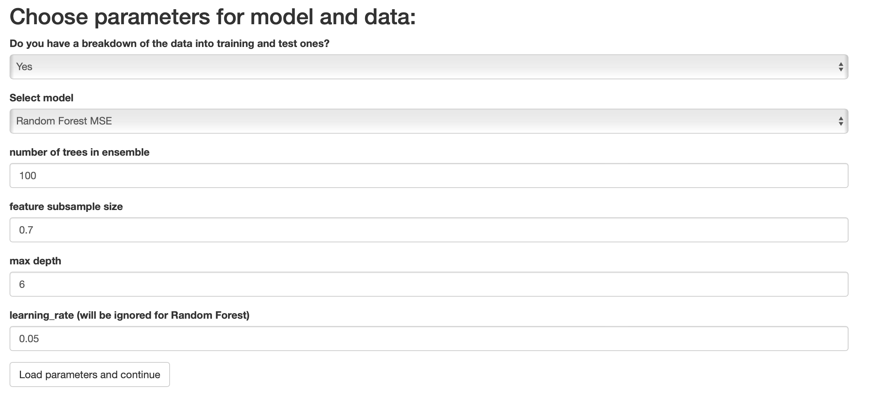
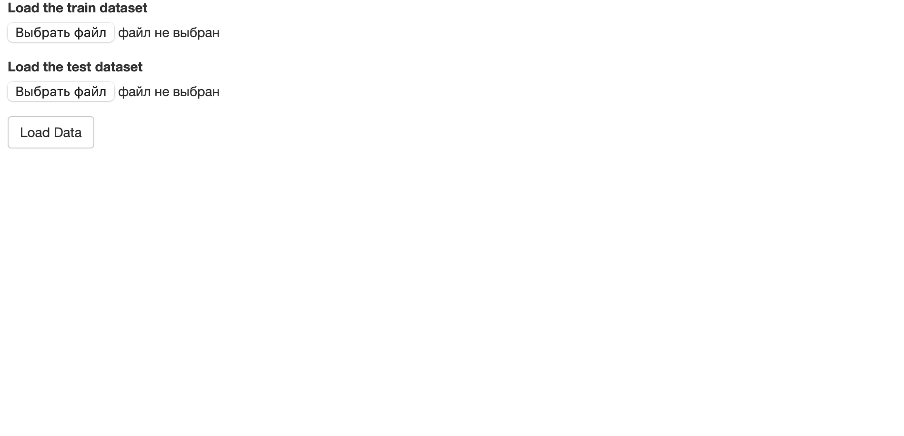
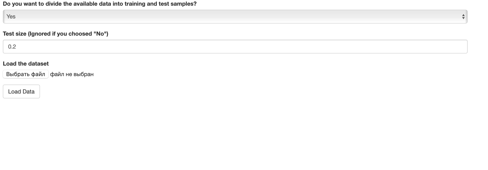
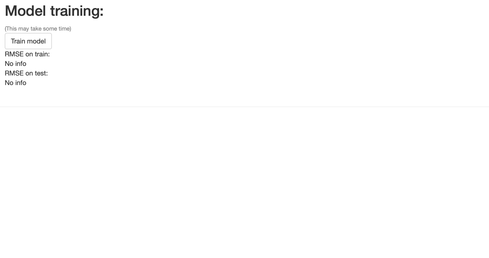
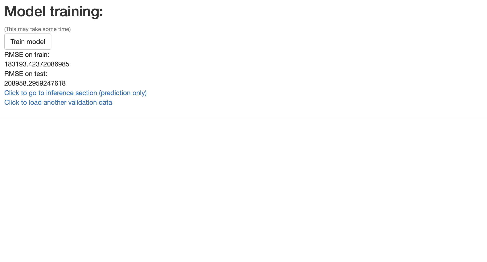
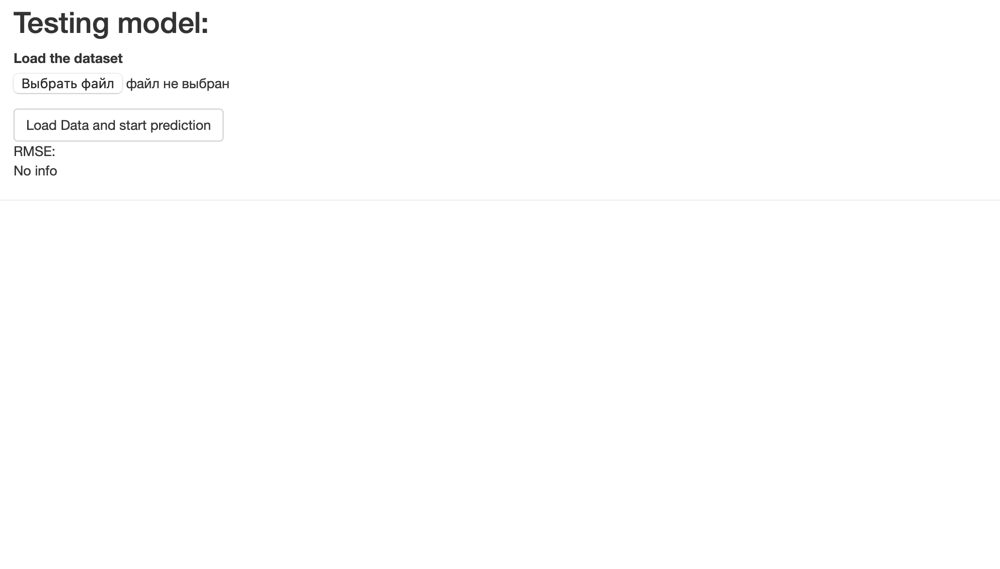
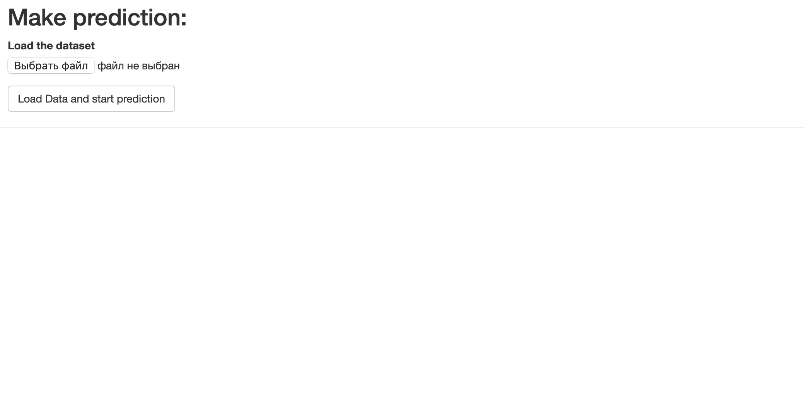

# Web service for training ensemble regression models

## Installing

First you need to assemble the docker container with the command below (it only needs to be done once):

```
sh scripts/build.sh
```

To start, use:

```
sh scripts/run.sh
```

The service will be available in the browser at http://localhost:5000

## Functionality

Clicking on the [link](http://localhost:5000) takes you to the page for selecting model parameters



You are immediately asked to choose which data you have now (training and test samples or only training). Next, it is suggested to select models (`Random Forest MSE` and `Gradient Boosting MSE`) and set their parameters. For a random forest, the `learning_rate` field will be ignored. After selecting all the parameters, click on the "Load parameters and continue" button to proceed to the next stage.

Next, depending on what you chose in the first question, you will be taken to a page with two downloads (training and test) 



or one dataset



Here you will be asked to divide the existing dataset into training and test samples. If you don't want to do this, click "no", otherwise click "yes". If you clicked "yes", you will be asked to select a fraction from the current dataset that will be included in the test sample

**Important!** To load the dataset, only the csv format is supported, where the target is set in the `price` column.

Next, you need to click on the "Load Data" button.

Click on the "Train Model" button to start train model. This may take some time.



Next, the model will be trained and you will be able to see the quality of the model on the training and test (if you uploaded them) data.



Next, you can test your model again, but on other data (by clicking on the appropriate link) or go to the inference (the mode when the model works in production - makes predictions).

Depending on the option you choose, you will be taken to one of the following pages with an identical interface:

This



or this



Next, to get started, you need to click on the button "Load Data and start prediction"
